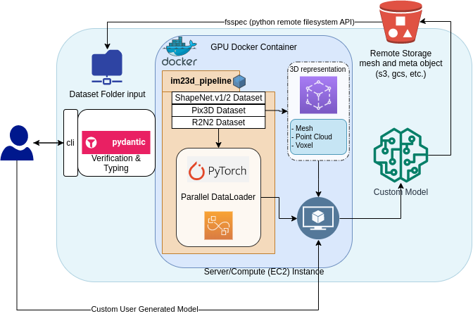

# 2d 3d Pipeline Project Repo 

!!!!!!!!!!!!!!!! Under construction !!!!!!!!!!!!!!!




This repo is meant to be a Bring Your Own Model (BYOM) for 2d to 3d datasets. The dataset is a folder you point to, and you can write just a simple function to get metadata into the `dataCatalog.csv` or use the already generated `Pix3dDataset`, `ShapeNetCoreDataset`, `ABODataset`datasets!

Other repos have been research type codes, and hard to replicate leading to large barriers and lots of foreheads hitting keyboards for just getting an
OccNet, Pix2Vox, SDFnet, 3DShapeGen, etc, etc. model running. The goal of this repo is to lower this barrier, and get all the ETL (dataset, dataloader, metadata reading/writing) for the most commonly used datasets in an easy to use and reproducable form.

The **hope** is that this will help lower the barrier to entry for people interested in this area of research and ensure that there are consistent, reproducable results for training, testing, and generating such 2d image to 3d
model neural network/statistical models.

This repo is the final result of many hours of hard work for a class project in CS 6743 at [Georgia Tech M.S. Data Analytics](https://catalog.gatech.edu/programs/analytics-ms/)

<!--  a gif of it working once it's done! -->

## Setup and Introduction

`im23D_pipeline` can be pip installed as well. (this is mostly in progress)


### Development Environment

To install the `conda` environment and the `jupyter` kernel with the full development environment,
clone the repo and run: 

```bash
$ cd ~/dev-or-some-folder/im23D_pipeline
$ bash install.sh
```

To uninstall the environment and kernel run:

```bash
$ cd ~/dev-or-some-folder/im23D_pipeline
$ bash uninstall.sh
```

**_NOTE:_** This repo uses [trimesh](https://trimsh.org/trimesh.html) a wonderful fully featured 3d mesh package **all in python**. While I realize many of the repos listed above have really fancy cython, cuda, etc. mesh generation and computation functions, I've found this to be a huge headache! So this might not be the most optimized form, but it's portable and easy to use!

**_NOTE:_** This repo assumes that the user is running on Linux (for right now), if possible, Windows users should setup something like [WSL, with miniconda, and vscode](https://www.bradleysawler.com/engineering/python-conda-wsl-2-ubuntu-setup-on-windows-10/) or [this How-to](https://gist.github.com/kauffmanes/5e74916617f9993bc3479f401dfec7da) 

## Contributing

Pull requests are welcome! For major changes, please open an issue first to discuss what you would like to change.


## License
[MIT](https://choosealicense.com/licenses/mit/) © [Andrew Bartels](https://github.com/andrewbartels1)

## Buy me a coffee!
<a href="https://www.buymeacoffee.com/andrewbartc" target="_blank"></a>
